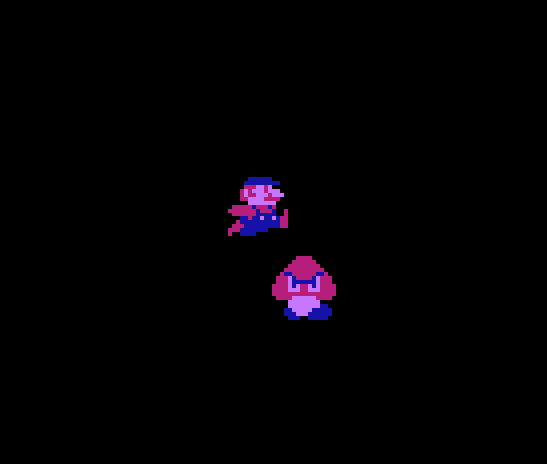
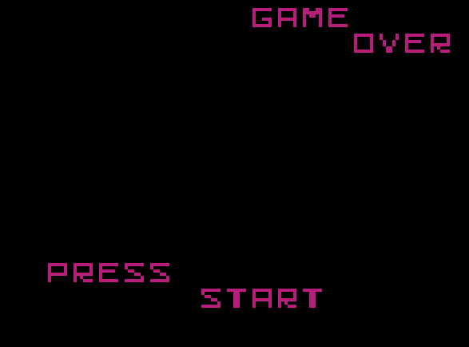

Simple NES Rom. Press start on the title screen, move Mario and avoid the Goomba! :-)

File description:
 - NESASM3 is a fantastic Assembler provided by the "Nerdy Nights" tutorials
 - "mario2.chr" contains some graphic information
 - draft.asm is the source code, written in assembly (6502)
 - the .nes is the compiled ROM, compatible with original hardware

